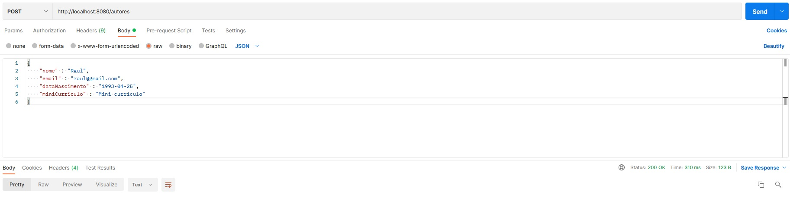
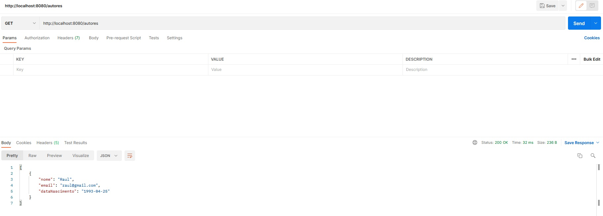
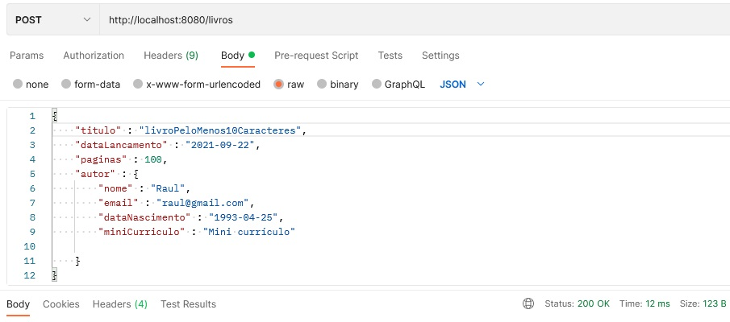
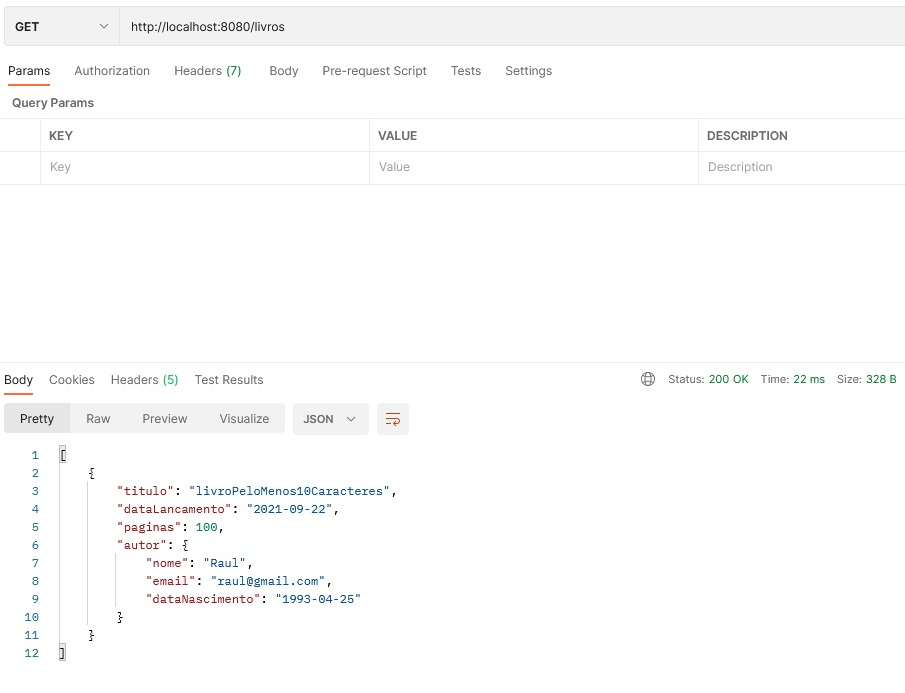
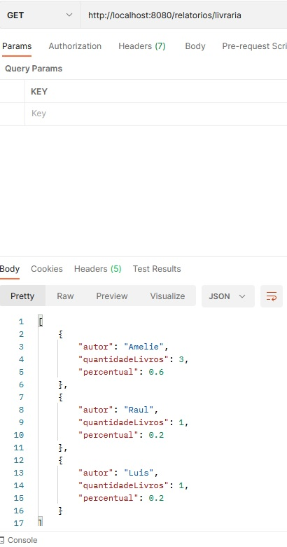

  

<space><space>
<space><space>
<space><space>

 

 Bootcamp Java da Alura - Projeto 03 - Biblioteca API

Tabela de Conteúdos
=================
  <!--ts-->

* [Projeto do módulo 3 do bootcamp java da Alura 2021](#projeto-do-módulo-3-do-bootcamp-java-da-alura-2021)
* [Novas funcionalidades](#novas-funcionalidades)
* [Demonstração do funcionamento](#demonstração-do-funcionamento)
    * [Requisição para cadastrar autor em formato JSON](#requisição-para-cadastrar-autor-em-formato-json)
    * [Requisição para listar autor em formato JSON](#requisição-para-listar-autor-em-formato-json)
    * [Requisição para cadastrar livro em formato JSON](#requisição-para-cadastrar-livro-em-formato-json)
    * [Requisição para listar livro em formato JSON](#requisição-para-listar-livro-em-formato-json)
    * [Relatório que devolve a quantidade de livros por autor e a porcentagem de cada autor na composição do acervo bibliográfico](#relatório-que-devolve-a-quantidade-de-livros-por-autor-e-a-porcentagem-de-cada-autor-na-composição-do-acervo-bibliográfico)

- [Tecnologias](#tecnologias)
- [Contato](#contato)
  <!--te-->

## Projeto do módulo 3 do bootcamp java da Alura 2021

Trata-se de uma aplicação web em Java para gestão de uma livraria online. A primeira parte do projeto (módulo 1) pode
ser consultada neste [repositório](https://github.com/raul-lima/bootcamp-java-projeto01) e a segunda parte (módulo 2), neste [repositório](https://github.com/raul-lima/bootcamp-java-projeto02). A aplicação permite o cadastro
e a listagem de autores e livros no modelo de API, de modo que as informações são consumidas e devolvidas no formato
JSON.
 
 
A funcionalidade de cadastro de livros realiza as seguintes validações:

* Título deve ser obrigatório e ter no mínimo 10 caracteres;
* Data de lançamento deve ser uma data menor ou igual a data atual;
* O número de páginas deve ser maior ou igual a 100.
  
## Novas funcionalidades
  
  * A camada de persistência foi implementada em um banco de dados local MySQL com Spring Data JPA;
  * Controle de evolução do schema do banco de dados da API utilizando o Flyway como ferramenta de migration;
  * As funcionalidades de listagem de autores e de livros agora possuem o recurso de paginação;
  * A aplicação agora permite a devolução de um relatório em formato JSON que exibe, com base no banco de dados local, uma lista com os autores, a quantidade de livros de cada autor e o percentual de cada autor na composição do acervo bibliográfico.

## Demonstração do funcionamento

### Requisição para cadastrar autor em formato JSON

### Requisição para listar autor em formato JSON

  
---

### Requisição para cadastrar livro em formato JSON

### Requisição para listar livro em formato JSON

  
 ---
  
### Relatório que devolve a quantidade de livros por autor e a porcentagem de cada autor na composição do acervo bibliográfico
  
  

## Tecnologias

Para a construção da aplicação java web foram utilizados:

* API Rest
* Bean Validation
* DTO pattern
* Flyway
* Java
* Lombok
* ModelMapper
* MySQL
* Spring Boot
* Spring Data JPA

Para testar as funcionalidades da API pode ser utilizada a ferramenta
gratuita [Postman](https://www.postman.com/downloads/), conforme demonstrado na seção anterior.

## Contato

<a href="https://www.linkedin.com/in/raultlima/">
 
 
 

