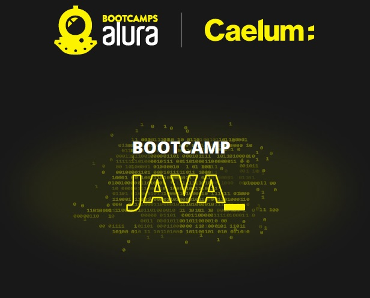

  

<space><space>
<space><space>
<space><space>

 

 Bootcamp Java da Alura - Projeto final - Livraria API

Tabela de Conteúdos
=================
  <!--ts-->

* [Projeto final do bootcamp java da Alura 2021](#projeto-final-do-bootcamp-java-da-alura-2021)
* [Funcionalidades](#funcionalidades)
* [Tecnologias](#tecnologias)
* [Contato](#contato)
  <!--te-->

## Projeto final do bootcamp java da Alura 2021

Trata-se de uma aplicação web em Java para gestão de uma livraria online desenvolvida em módulos:
 * [Módulo 01](https://github.com/raul-lima/bootcamp-java-projeto01)
 * [Módulo 02](https://github.com/raul-lima/bootcamp-java-projeto02) 
 * [Módulo 03](https://github.com/raul-lima/bootcamp-java-projeto03)
 * [Módulo 04](https://github.com/raul-lima/bootcamp-java-projeto04)
 * [Módulo 05](https://github.com/raul-lima/bootcamp-java-projeto05)
  
  A aplicação permite o cadastro, listagem, atualização, remoção e detalhamento de autores e livros no modelo de API, de modo que as informações são consumidas e devolvidas no formato
JSON.
  
## Funcionalidades

* Camada de persistência com Spring Data JPA
* Controle de evolução do schema do banco de dados da API utilizando o Flyway como ferramenta de migration;
* Paginação na listagem de autores e livros;
* Relatório em formato JSON que exibe, com base no banco de dados local, uma lista com os autores, a quantidade de livros de cada autor e o percentual de cada autor na composição do acervo bibliográfico;
* CRUD completo, além de uma funcionalidade para pesquisar por um livro ou autor específico por ID;
* Validações cadastrais;
* Tratamento dos erros 400, 404 e 500;
* Testes automatizados com JUnit, AssertJ e Mockito;
* A documentação da API é gerada automaticamente com a ferramenta Swagger.
* Segurança implementada com módulos do Spring Security e do JJWT;
* Autenticação e autorização da API de maneira stateless;
* Criação de usuários e perfis para controle de acesso;
* Filter para verificar os tokens de acesso à API;
* Deploy automatizado no Heroku;
* Envio de e-mail após o cadastro de um novo usuário, informando o login e a senha gerada automaticamente;

## Tecnologias

Para a construção da aplicação java web foram utilizados:

* Docker
* Flyway
* Java
* MySQL
* Spring Boot
* Spring Security
* Swagger

Para testar as funcionalidades da API pode ser utilizada a ferramenta
gratuita [Postman](https://www.postman.com/downloads/). Também é possível realizar os testes por meio da documentação gerada pelo swagger, acessível por meio do seguinte caminho: http://localhost:8080/swagger-ui.html (em ambiente de desenvolvimento).

## Contato

<a href="https://www.linkedin.com/in/raultlima/">
 
 
 

